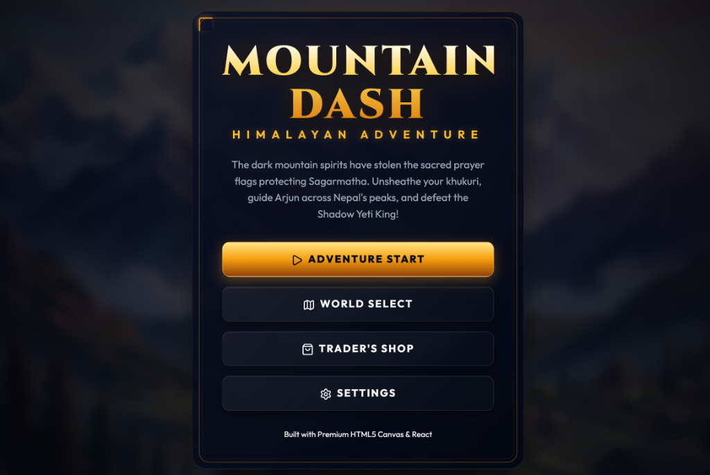
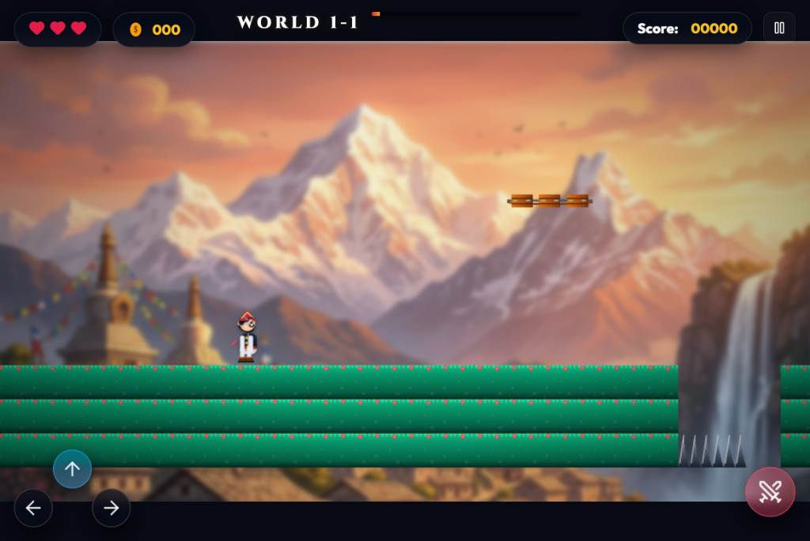

# Mountain Dash - Himalayan Adventure 🏔️🚶‍♂️

A premium, modern 2D side-scrolling platformer built using **React**, **Vite**, and **HTML5 Canvas**. Guide Arjun across the heights of the Himalayas, battle mystical creatures with your khukuri, collect coins, and recover the sacred prayer flags protecting Sagarmatha.

---

## 📸 Screenshots

### Main Menu


### Active Gameplay (Himalayan Peak Level & Responsive Mobile Controls)


### Victory Screen


---

## 🌟 Key Features

- **Dhaka Topi & Kathmandu-Themed Style**: Procedural character sprites and animations styled after traditional Nepalese clothing (Jakarta Dhaka Topi, Daura Suruwal, Patuka sash, and hiking boots).
- **Dynamic Physics & Procedural Canvas Assets**: Specular crystal caves, glowing ice, rustic rope bridges, and high-fidelity Nepal-themed tiles drawn procedurally at runtime.
- **Optimized Mobile Layout**: 
  - Left virtual D-pad: Left, Right, and Jump (Up Arrow) arranged in an intuitive inverted-T layout.
  - Right action area: Single large Attack button with a glowing red aura.
  - Multi-trigger Up key: The same Up arrow on mobile allows jumping and climbing ropes smoothly.
- **Parallax Environments & Weather**: Smooth multi-layered mountains background with realistic weather particle systems (blossom petals, rain, mountain wind, and snow).
- **Performance Optimizations**:
  - **Suspend Idle Loop**: The `requestAnimationFrame` loop suspends when paused or game-over to achieve 0% idle CPU and prevent device heating.
  - **Offscreen Pre-blurring**: Cinematic background blurs are pre-rendered offscreen to avoid expensive runtime canvas pixel filters.
  - **Gradient Caching**: Sky, sun, and vignette gradients are cached to eliminate garbage collection pauses.

---

## 🎮 How to Play

### Keyboard Controls
| Action | Key Bindings |
|---|---|
| **Move Left** | `A` or `←` |
| **Move Right** | `D` or `→` |
| **Climb Ropes / Up** | `W` or `↑` |
| **Sprint** | `Shift` |
| **Jump / Double Jump** | `Space` |
| **Attack (Khukuri Sword)**| `K`, `J` or `Enter` |

### Mobile Touch Controls
- Use the left D-pad to move Left and Right.
- Tap the **Up Arrow** on the left D-pad to Jump / Double Jump or Climb Ropes.
- Tap the **Swords Button** on the right side to slice enemies with your khukuri or fire blade projectiles.

---

## 🚀 Setup & Execution

### Prerequisites
- Node.js (v18 or higher recommended)
- npm (v9 or higher)

### Installation
Clone the repository and install dependencies:
```bash
npm install
```

### Running Locally
Launch the Vite development server:
```bash
npm run dev
```

### Building for Production
Create the optimized production build:
```bash
npm run build
```

Preview the production build locally:
```bash
npm run preview
```
